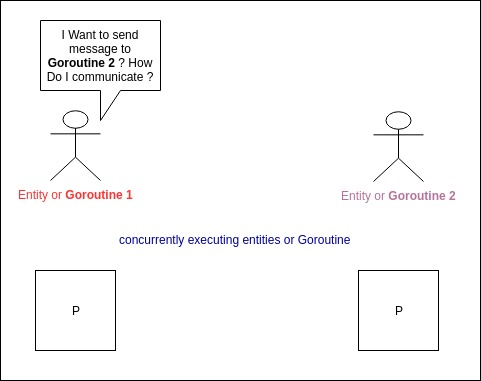

## goroutine.

1. What is the responsibilty of the goroutine ?
2. How can we synchronize and communicate multiple goroutines ?
3. Also master goroutine needs to control the child

**The synchronization and communication between multiple goroutine can be roughly summed up as three ways**

- Global shared variable
- Channel communication (CSP model)
- Context package

i.e

### How to control concurrency in Golang.

Execute ordinary function concurrently. Use keyword `go`.

But in actual concurreny application we requires synchronization between goroutines, Communication, as well as precise control of the start end end of the sub-goroutine.

Think of typical Scenario. Our main program is running and we sent `ctrl + c` signal. How to tell all the goroutine that has been spawned to gracefully exits.

The way goroutine has been designed, is that goroutine can only be controlled by itself, and cannot be forced to end from outside.

Exception - When the main function end or program crash.

### Global shared variable.

1. Declare a global variable
2. All child goroutines share this varibale and continuously pool this varibale to check for updates.
3. Change the global variable in the main process.
4. The child goroutine detects the global variable update and execute the corresponding logic.

```Go
func main() {
	keepRunning := true

	goF := func() {
		for keepRunning {
			fmt.Println("Gang of goroutine running")
			time.Sleep(1 * time.Second)
		}
		fmt.Println("Gang of goroutine Exiting :(")
	}
	go goF()
	go goF()
	go goF()
	time.Sleep(2 * time.Second)
	keepRunning = false
	time.Sleep(3 * time.Second)
	fmt.Println("main goroutine exit")
}
```

**Advantage** does not require too many complicated operations.

**Disadvantage**

1. variable can only be read or write - Data race condtion.(can be solved using Mutex)
2. Not suitable for communication between child goroutine, as we are passing global variable.
3. Main process cannot wait for all goroutine to exit, goroutine one way notification.

### Channel communication

What is the problem the channel is trying to solve.

`Channel` - Channel is a core type in `go`. Mental Model.

**A Pipe through which a unit of data can be sent or received for communication**

Bit of `CSP`. - Communicating Sequential Processes



> CSP Model consists of concurrently executing entities(threads or processes). The entitites communicate by sending messages

In `Go` instead by directly communicating with the process we use `channel`.

Key to `CSP` model is focus on the `channel` not the entity that sends the message, and this **passing of message is usually `synchronous`**
